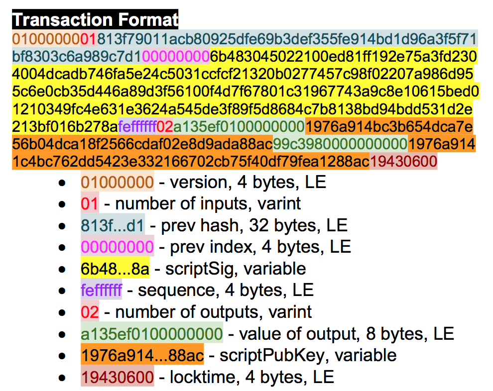

# Parsing Transactions

Transactions are at the heart of Bitcoin. Transactions, simply put, are value transfers from one entity to another. We'll see later how "entities" in this case are really smart contracts. But we're getting ahead of ourselves. Lets first look at what transactions in Bitcoin are, what they look like and how they are parsed.

### Transaction Components

At a high level, a transaction really only has 4 components. They are:

1. Version
2. Inputs
3. Outputs
4. Locktime

At this point a general overview of these fields might be helpful. Version defines what the format of the transaction is supposed to be, Inputs define what bitcoins are being spent, Outputs define where the bitcoins are going and Locktime defines what time this transaction starts being valid. We'll go through each component in depth.



### Version

When you see a version number in something, it's meant to give the receiver information about what the versioned thing is supposed to represent. If, for example, you are running Windows 3.1, that's a version number that's very differnt than Windows 8 or Windows 10. You could specify just "Windows", but specifying the version number after the operating system helps you know what features it has and what API's you can program against.

In a similar way, Bitcoin transactions have version numbers. In Bitcoin's case, the transaction version has never been updated since version 1.

You may notice here that the actual value in hexadecimal is 01000000, which doesn't look like 1. It actually is when the interpreted as a little-endian integer.

### Test Driven Exercise

Parse the transaction version.


```python
from tx import Tx
from helper import (
    little_endian_to_int,
    read_varint,
)

class Tx(Tx):

    @classmethod
    def parse(cls, s):
        '''Takes a byte stream and parses the transaction at the start
        return a Tx object
        '''
        # s.read(n) will return n bytes
        # version has 4 bytes, little-endian, interpret as int
        # leave inputs, outputs and locktime empty for now
        # return an instance of the class... cls(version, inputs, outputs, locktime)
        pass
```
